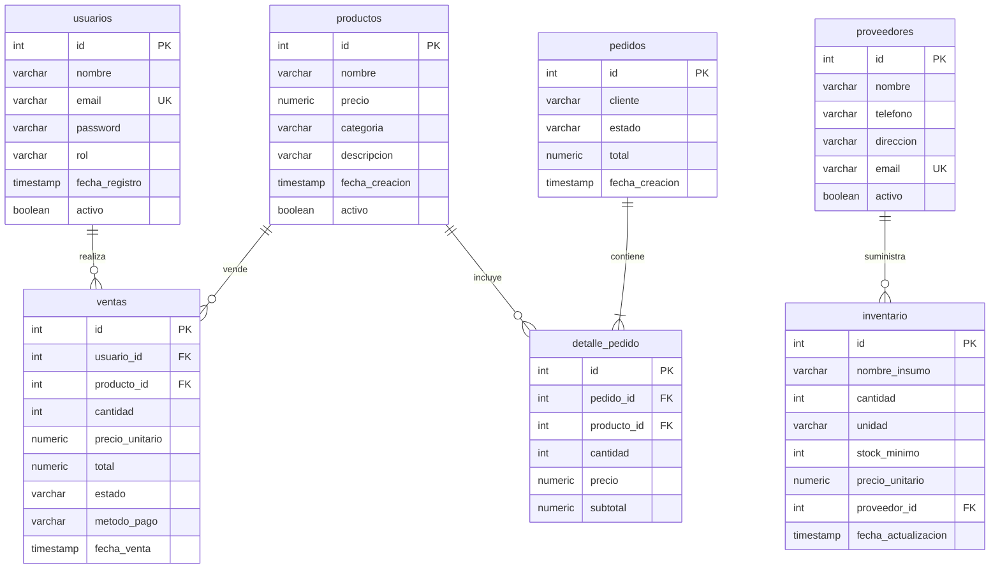

# Diseño de base de datos — Cafedronel (PostgreSQL)

Base de datos relacional alineada con el backend Spring Boot: usuarios, productos, proveedores, inventario, pedidos, detalles y ventas.

## Diagrama lógico



## Scripts (orden obligatorio)

| Versión | Archivo Flyway | Qué crea |
|---------|----------------|----------|
| **V0** | `V0__bootstrap.sql` | Marcador de inicio (esquema vacío) |
| **V1** | `V1__usuarios.sql` | Tabla `usuarios` |
| **V2** | `V2__productos.sql` | Tabla `productos` |
| **V3** | `V3__proveedores.sql` | Tabla `proveedores` |
| **V4** | `V4__inventario.sql` | Tabla `inventario` (FK a proveedor) |
| **V5** | `V5__pedidos.sql` | `pedidos` + `detalle_pedido` |
| **V6** | `V6__ventas.sql` | Tabla `ventas` |
| **V7** | `V7__indices_y_datos_demo.sql` | Índices + datos de prueba |

Copias manuales (mismo contenido): `database/scripts/V0__bootstrap.sql` … `V7__indices_y_datos_demo.sql`.

### Mantenimiento tras pruebas (Postman / pgAdmin)

| Script | Uso |
|--------|-----|
| [limpiar_productos_duplicados_y_catalogo.sql](scripts/limpiar_productos_duplicados_y_catalogo.sql) | Quita duplicados por `nombre`, inserta menú faltante y renumera IDs 1…N |
| [reordenar_ids_productos.sql](scripts/reordenar_ids_productos.sql) | Solo renumera `productos.id` sin huecos y actualiza FK |
| [eliminar_producto_por_id.sql](scripts/eliminar_producto_por_id.sql) | Borra un producto por id y sus filas en `detalle_pedido` y `ventas` |

Detalle de ejecución: [database/scripts/README.md](scripts/README.md).

## Crear la base en PostgreSQL (una sola vez)

```sql
CREATE DATABASE cafedronel
    WITH ENCODING 'UTF8'
    LC_COLLATE 'es_PE.UTF-8'
    LC_CTYPE 'es_PE.UTF-8'
    TEMPLATE template0;
```

En Windows, si falla el locale, usa solo:

```sql
CREATE DATABASE cafedronel;
```

Luego conéctate a `cafedronel` y deja que **Flyway** ejecute V0–V7 al arrancar la app, o ejecuta los scripts de `database/scripts/` en orden.

## Variables de entorno (backend)

```
DB_URL=jdbc:postgresql://localhost:5432/cafedronel
DB_USER=postgres
DB_PASSWORD=tu_password
JPA_DDL_AUTO=validate
```

## Nota sobre el modelo Java

- **JPA hoy:** `usuarios`, `productos`, `proveedores`, `inventario`, `pedidos`, `detalle_pedido` y `ventas`.
- Las tablas V3–V6 ya están conectadas a repositorios JPA sin cambiar la API REST.

## Usuario demo (V7)

| Campo | Valor |
|-------|--------|
| Email | `admin@cafedronel.com` |
| Contraseña | `password` (cambiar en producción) |
| Rol | `ADMIN` |
